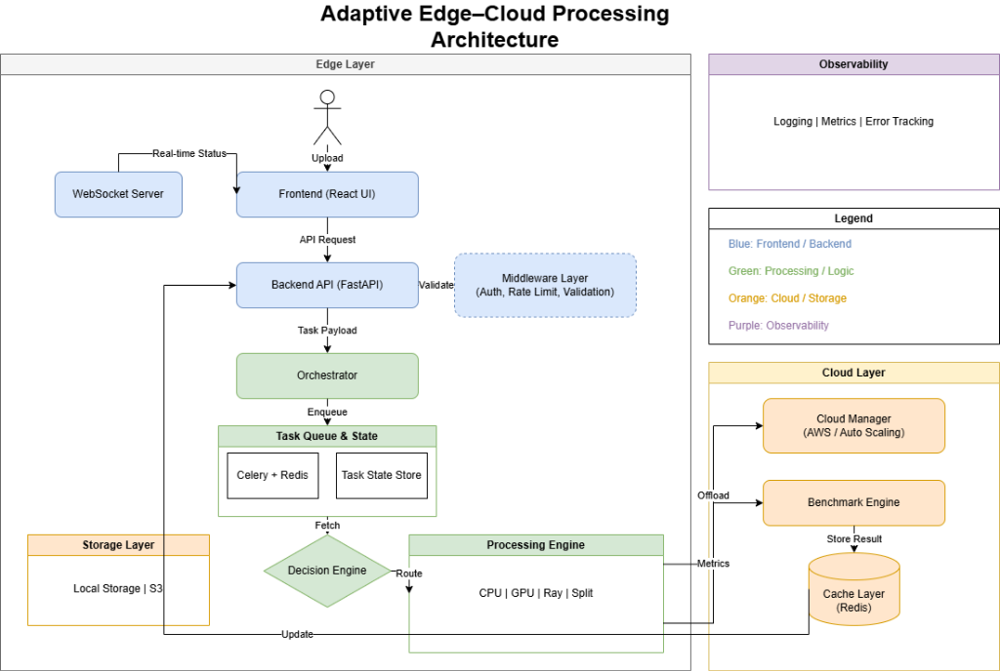

# Adaptive Edge–Cloud Image/Video Processing System v2.0

> **Intelligent LOCAL / CLOUD / SPLIT execution** for image/video processing with auto-scaling, parallel computing, and real-time benchmarking.

---

## 🏗️ System Architecture

<p align="center">
  
</p>

The system dynamically selects the optimal execution mode based on real-time system profiling, network conditions, energy constraints, and workload complexity:

| Mode | When Used | How It Works |
|------|-----------|--------------|
| **LOCAL** | Strong system + low load, or poor network | CPU multiprocessing / GPU (PyTorch CUDA) |
| **CLOUD** | Low battery, or default delegation | AWS EC2/S3 or simulated cloud with auto-scaling |
| **SPLIT** | Complex workload + good network | Hybrid pipeline: pre/post-process locally, heavy compute on cloud |

---

## ✨ Key Features

- 🧠 **Deterministic Decision Engine** — Scoring-based mode selection with explainable reasoning
- ⚡ **GPU-Accelerated Processing** — Memory-safe PyTorch batching with automatic OOM → CPU fallback
- 🔄 **Distributed Computing** — Ray-based parallelism inside Celery task lifecycle
- ☁️ **Cloud Simulation** — Run without real AWS; simulated providers with realistic latency/cost profiles
- 📊 **Real-time Benchmarking** — Latency, throughput, CPU/GPU usage, cost, energy, speedup
- 🖥️ **Rich React Dashboard** — Live pipeline visualization, before/after comparison sliders, and real-time auto-refreshing system telemetry
- 🔐 **Production Security** — JWT authentication, rate limiting (60 req/min), file validation
- 🌐 **WebSocket Updates** — Live task progress pushed to the React dashboard
- 🤖 **DQN Reinforcement Learning** — Optional RL agent for adaptive mode selection
- 🔋 **Energy-Aware** — Multi-component energy model: `E = E_cpu + E_gpu + E_network`
- 🛡️ **Fault Tolerant** — 3× retry with exponential backoff, cloud → local fallback, per-stage checkpointing

---

## 🚀 Quick Start

### Prerequisites
- Python 3.10+
- Node.js 18+
- Docker (for Redis)

### 1. Install Backend Dependencies
```bash
pip install -r requirements.txt
```

### 2. Install Frontend Dependencies
```bash
cd frontend && npm install && cd ..
```

### 3. Configure Environment
```bash
copy .env.example .env
# Edit .env if needed (defaults work for development)
```

### 4. Launch Everything
```bash
run.bat
```

Or manually:
```bash
# Terminal 1: Redis
docker-compose up -d

# Terminal 2: Celery Worker
python -m celery -A orchestrator.tasks worker --loglevel=info --pool=solo

# Terminal 3: Backend
python -m uvicorn backend.main:app --host 0.0.0.0 --port 8000 --reload

# Terminal 4: Frontend
cd frontend && npm start
```

### 5. Open Dashboard
- 🖥️ Frontend: http://localhost:3000
- 📖 API Docs: http://localhost:8000/docs
- 💚 Health: http://localhost:8000/health

---

## 📦 Modules

| Module | Directory | Stack |
|--------|-----------|-------|
| Frontend | `frontend/` | React + Chart.js |
| Backend | `backend/` | FastAPI + Uvicorn |
| Agent | `agent/` | psutil, GPUtil, PyTorch |
| Decision Engine | `decision/` | Python (deterministic scoring) |
| Orchestrator | `orchestrator/` | Celery + Redis |
| Processing Engine | `processing/` | multiprocessing, PyTorch, Ray |
| Cloud Manager | `cloud/` | boto3 / Simulator |
| Benchmark Engine | `benchmark/` | psutil, GPUtil |
| ML (RL) | `ml/` | PyTorch DQN |
| Storage | `storage/` | Filesystem + S3 |
| Observability | `observability/` | Structured JSON logging |

---

## 📐 Project Structure

```
├── backend/           # FastAPI server + routes (9 files)
├── agent/             # System/network/energy profiling (4 files)
├── decision/          # Decision engine + scoring (4 files)
├── processing/        # CPU, GPU, Ray, Split pipeline (7 files)
├── cloud/             # AWS/simulator + auto-scaling (5 files)
├── orchestrator/      # Celery tasks + state manager (5 files)
├── benchmark/         # Metrics, cache, reporting (5 files)
├── ml/                # DQN RL agent + trainer (5 files)
├── storage/           # Local + cloud storage (3 files)
├── observability/     # Logger, metrics, error tracker (4 files)
├── frontend/          # React + Chart.js dashboard (16 files)
├── docs/              # IEEE system design + architecture diagram
├── docker-compose.yml # Redis service
├── requirements.txt   # Python dependencies
├── .env.example       # Environment configuration
└── run.bat            # Windows launcher script
```

---

## 🔐 Default Credentials (Dev Mode)
- Username: `admin` / Password: `admin123`
- Auth is disabled by default (`AUTH_ENABLED=false`)

## 🤖 Train RL Agent (Optional)
```bash
python -m ml.trainer --episodes 1000
```

---

## 📄 Documentation

- **[IEEE System Design Paper](docs/system_design.md)** — Full technical blueprint with algorithms, formulas, and architecture details

## 📄 License

This project is developed as part of an M.Tech Parallel Computing research project.
